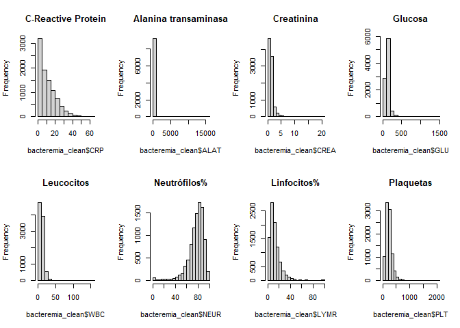
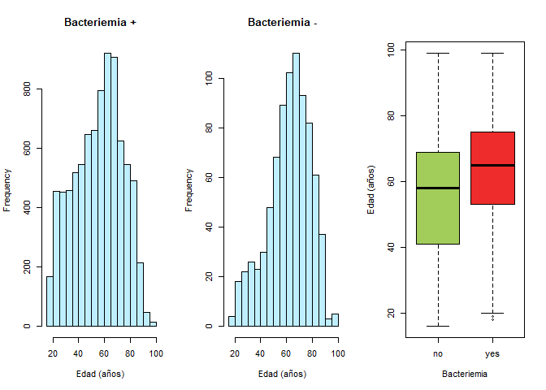
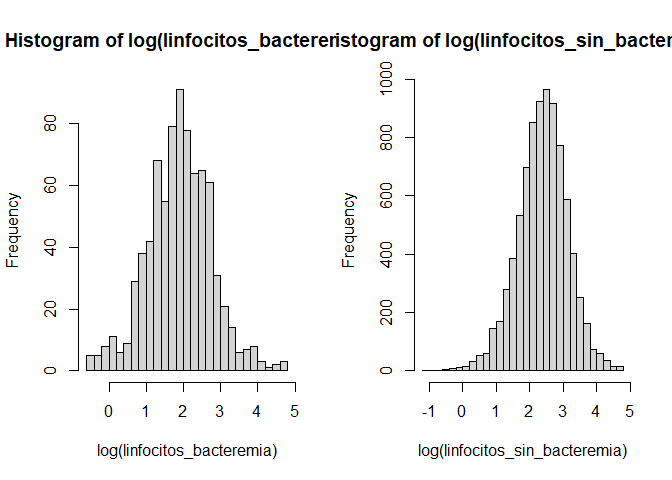
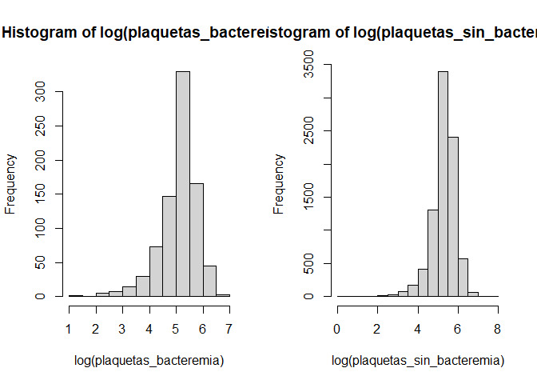
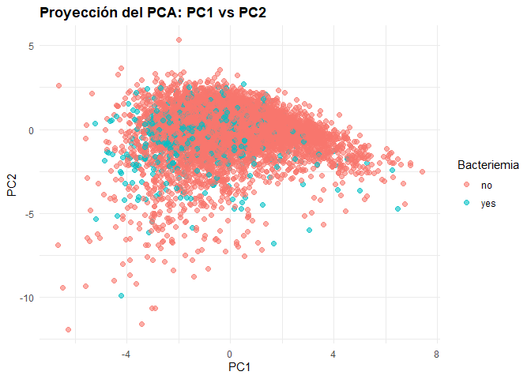
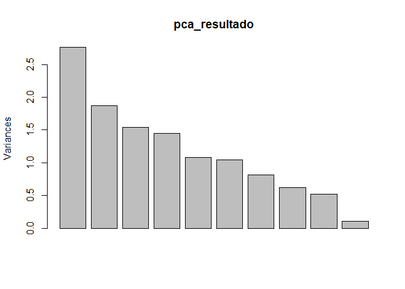

PEC4 - Software para el Análisis de Datos
================
Samara Sabsabi Soriano y Daniel Yagüe Puerto
2026-08-16

## Sección 1. Contexto y objetivo del estudio. Datos

Se ha seleccionado el conjunto de datos Bacteremia procedentes del
Departamento de Bioestadística de la universidad de Vanderbilt. Se trata
de un dataset con varias variables asociadas a la bacteriemia, la
presencia de bacterias viables en el torrente sanguíneo.

Se ha elegido este conjunto de datos por contener variables categóricas
y contínuas, además de un número de registros elevados. Contiene la
variable objetivo “BloodCulture”, por lo que permite analizar la
relación entre diversos biomarcadores (glucosa, creatinina, etc.) y
datos demográficos (edad y sexo) con la bacteriemia. Este estudio está
enfocado en definir los efectos de la bacteriemia sobre la población y
en encontrar los mejores predictores de bacteriemia sin necesidad de
realizar un hemocultivo.

**Referencias:**

- Heinze, G. (2023). Bacteremia \[Data set\]. In PLoS One (Version S2,
  Vol. 9, Number 9, p. e106765). Zenodo.
  <https://doi.org/10.5281/zenodo.7554815>

- Smith DA, Nehring SM. Bacteremia. \[Updated 2023 Jul 17\]. In:
  StatPearls \[Internet\]. Treasure Island (FL): StatPearls Publishing;
  2026 Jan-. Available from:
  <https://www.ncbi.nlm.nih.gov/books/NBK441979/>

## Sección 2. Prospección y preparación de los datos

``` r
bacteremia_dataset <- as.data.frame(readr::read_csv("Bacteremia_public_S2.csv"))
```

    ## Rows: 14691 Columns: 53
    ## ── Column specification ────────────────────────────────────────────────────────
    ## Delimiter: ","
    ## chr  (1): BloodCulture
    ## dbl (52): ID, SEX, AGE, MCV, HGB, HCT, PLT, MCH, MCHC, RDW, MPV, LYM, MONO, ...
    ## 
    ## ℹ Use `spec()` to retrieve the full column specification for this data.
    ## ℹ Specify the column types or set `show_col_types = FALSE` to quiet this message.

### 2.1 Descripción de los datos

El conjunto de datos Bacteremia consiste en 14691 observaciones de
pacientes con sospecha de sufrir bacteriemia. A dichos pacientes se les
realizó un hemocultivo para determinar la presencia de bacteriemia y se
midieron 51 predictores potenciales, generando un total de 53 variables.

``` r
dim(bacteremia_dataset)
```

    ## [1] 14691    53

``` r
head(bacteremia_dataset)
```

    ##   ID SEX AGE   MCV  HGB  HCT PLT  MCH MCHC  RDW  MPV LYM MONO EOS BASO NT APTT
    ## 1  1   2  62  99.3 11.5 35.9 307 31.5 31.8 19.5 10.8 0.4  1.7 0.0  0.1 86 28.8
    ## 2  3   1  72  85.1 10.3 34.7 182 26.0 30.6 15.0  9.7 0.4  0.2 0.1  0.0 90 29.8
    ## 3  5   1  46  96.3  7.4 22.8  64 31.2 32.4 19.7 11.1 1.5  1.2 0.1  0.1 58 36.3
    ## 4  7   1  84  91.3 10.3 31.1 309 30.4 33.3 13.8  8.5 1.3  0.8 0.0  0.0 67 38.2
    ## 5  9   2  38  85.1 13.7 38.7 183 30.2 35.3 12.6 10.0 0.8  0.4 0.0  0.0 95 33.1
    ## 6 10   1  68 104.5 15.7 46.9 144 34.8 33.5 13.9 10.9 2.2  0.9 0.1  0.0 61 41.8
    ##   FIB SODIUM POTASS   CA PHOS   MG CREA  BUN  HS GBIL   TP  ALB AMY PAMY LIP
    ## 1 578    137   3.88 2.29 1.20 0.66 0.65  5.7 5.3 0.59 67.0 36.7  30   16  10
    ## 2  NA    141     NA 2.21 0.58   NA 0.76 19.9  NA 0.48 65.3 37.4  NA   NA  NA
    ## 3 313    147   4.61 1.92 1.51 1.03 1.25 50.6  NA 8.42 40.5 22.1 146   NA  89
    ## 4 487    141   4.71 2.05 2.17 0.83 2.78 47.5 9.7 0.35 61.2 33.2  92   28  18
    ## 5 490    137     NA 2.34 0.97 0.74 0.65  8.5 3.0 0.42 78.4 43.8  84   50  50
    ## 6 400    141   4.41 2.08 0.99 0.56 0.82 15.3 5.5 2.40 57.5 30.1  95   57  25
    ##    CHE  AP ASAT ALAT GGT  LDH   CK GLU TRIG CHOL   CRP     BASOR      EOSR
    ## 1 5.12  85   22   14  48  284   23 107  105  175  3.94 0.4132231 0.0000000
    ## 2 5.61  80   28   25  61   NA   36  84   NA   NA  1.42 0.0000000 0.8264463
    ## 3 2.52 119  124  135 134  696   40 107   NA   NA 12.09 0.5681818 0.5681818
    ## 4 4.10  94  774   72  23 1787 2422 105  134  141  3.78 0.0000000 0.0000000
    ## 5 6.91 108   35   22  72   NA   79  93  152  167 11.17 0.0000000 0.0000000
    ## 6 6.79  68   32   11  68  263   75  89   85  144  5.89 0.0000000 1.0000000
    ##        LYMR    MONOR  NEU     NEUR  PDW RBC   WBC BloodCulture
    ## 1  1.652893 7.024793 22.0 90.90909 10.6 3.7 24.10           no
    ## 2  3.305785 1.652893 11.4 94.21488 11.4 3.9 12.17           no
    ## 3  8.522727 6.818182 14.7 83.52273 14.1 2.5 17.45           no
    ## 4 11.016949 6.779661  9.7 82.20339  8.7 3.5 11.58           no
    ## 5  8.333333 4.166667  8.4 87.50000 12.2 4.4  9.86           no
    ## 6 22.000000 9.000000  6.8 68.00000 12.9 4.3  9.94           no

Para este estudio hemos seleccionado las siguientes variables de interés
reduciendo el conjunto a 11 variables:

``` r
# Seleccionamos las variables de interés:
bacteremia_subset <- bacteremia_dataset %>% select(SEX, AGE, BloodCulture, WBC, NEUR, LYMR, PLT, CRP, GLU, CREA, ALAT)

str(bacteremia_subset)
```

    ## 'data.frame':    14691 obs. of  11 variables:
    ##  $ SEX         : num  2 1 1 1 2 1 1 1 1 2 ...
    ##  $ AGE         : num  62 72 46 84 38 68 55 55 67 52 ...
    ##  $ BloodCulture: chr  "no" "no" "no" "no" ...
    ##  $ WBC         : num  24.1 12.17 17.45 11.58 9.86 ...
    ##  $ NEUR        : num  90.9 94.2 83.5 82.2 87.5 ...
    ##  $ LYMR        : num  1.65 3.31 8.52 11.02 8.33 ...
    ##  $ PLT         : num  307 182 64 309 183 144 242 38 88 105 ...
    ##  $ CRP         : num  3.94 1.42 12.09 3.78 11.17 ...
    ##  $ GLU         : num  107 84 107 105 93 89 91 96 86 104 ...
    ##  $ CREA        : num  0.65 0.76 1.25 2.78 0.65 0.82 1.21 1.77 1 0.58 ...
    ##  $ ALAT        : num  14 25 135 72 22 11 20 32 57 156 ...

- **Sexo (SEX)**: Variable categórica (1 = male, 2 = female).

- **Edad (AGE)**: Variable numérica discreta (Años).

- **Cultivo (BloodCulture)**: Variable categórica (no, yes). Indica la
  presencia o ausencia de una bacteriemia en un hemocultivo. Dado que en
  el dataset la variable es de tipo cadena de texto (chr) la
  transformaremos a factor.

- **Recuento total de leucocitos (WBC)**: Variable numérica contínua
  (g/L). El aumento del número de leucocitos suele ir asociado a la
  respuesta a una infección.

- **Ratio de neutrófilos (NEUR)**: Variable numérica contínua (%).
  Porcentaje de neutrófilos respecto al total de leucocitos. Un elevado
  NEUR puede ser indicativo de infección bacteriana.

- **Ratio de linfocitos (LYMR)**: Variable numérica contínua (%).
  Porcentaje de linfocitos sobre el total de leucocitos. Un bajo LYMR
  suele asociarse con una mayor probabilidad de infección bacteriana.

- **Recuento de plaquetas (PLT)**: Variable numérica contínua (g/L).
  Puesto que intervienen en la respuesta inmunitaria, un bajo nivel de
  plaquetas está asociado a infecciones bacterianas.

- **C-reactive-protein (CRP)**: Variable numérica contínua (mg/dL).
  Proteína que aumenta rápidamente ante infecciones bacterianas.

- **Glucosa (GLU)**: Variable numérica contínua (mg/dL). Durante una
  infección grave, se puede producir un aumento de la glucosa en sangre,
  aunque es una variable que viene influenciada por muchos otros
  factores.

- **Creatinina (CREA)**: Variable numérica contínua (mg/dL). Altos
  niveles de creatinina indican deterioro de la función renal, una
  posible consecuencia de una infección grave.

- **Alanina transaminasa (ALAT)**: Variable numérica contínua (U/L).
  Altos niveles en sangre de esta enzima son indicativo de daño
  hepático, el cual puede ser consecuencia de una bacteriemia.

**Detección de NAs**

Realizamos un recuento de valores perdidos por cada variable:

``` r
colSums(is.na(bacteremia_subset))
```

    ##          SEX          AGE BloodCulture          WBC         NEUR         LYMR 
    ##            0            0            0          462          732          732 
    ##          PLT          CRP          GLU         CREA         ALAT 
    ##           42          155         4192          159          987

**Limpieza y transformación de variables**

Teniendo en cuenta el número de observaciones del conjunto de datos,
omitimos los registros con valores perdidos para tener un dataset
completo en todos sus registros y variables. También convertimos las
variables “SEX” y “BloodCulture” a factor.

``` r
# Eliminamos las observaciones con valores perdidos:
bacteremia_clean <- na.omit(bacteremia_subset)

# Convertimos las variables "BloodCulture" y "SEX" a factor:
bacteremia_clean$BloodCulture <- factor(bacteremia_clean$BloodCulture)
bacteremia_clean$SEX <- factor(bacteremia_clean$SEX,
                               levels = c(1, 2),
                               labels = c("male", "female"))

dim(bacteremia_clean)
```

    ## [1] 9297   11

Tras las transformaciones tenemos 9297 observaciones completas con 11
variables.

### 2.2 Preguntas “objetivo”

Nuestro estudio pretende definir si existen grupos demográficos con
mayor riesgo de sufrir bacteriemia, y evaluar que impacto tiene esta
enfermedad sobre funciones orgánicas y sobre las respuestas inflamatoria
y inmunológica, además de intentar identificar los mejores indicadores
bioquímicos para el diagnóstico de la enfermedad. Para ello nos
planteamos las siguientes preguntas:

**¿Existe alguna relación significativa entre la edad y la frecuencia de
bacteriemia positiva? ¿Existe alguna relación significativa entre el
sexo y la frecuencia de bacteriemia positiva?**

Definimos dos funciones para evaluarlo:

``` r
# Función para la edad:
prevalencia_edad <- function(datos) {
  
  # Creamos una variable para dividir la edad por rangos:
  datos$Rango_Edad <- cut(datos$AGE, 
                          breaks = c(0,30, 60, 100),
                          labels = c("Joven (0-30)", "Adulto (30-60)", "3a edad (>=60)"), include.lowest = TRUE)
  
  # Tabla de contingencia:
  tabla_cont <- table(datos$Rango_Edad, datos$BloodCulture)
  
  # Calculamos la prevalencia en cada grupo:
  prevalencias <- (tabla_cont[, "yes"] / rowSums(tabla_cont)) * 100
  
  cat("Prevalencias de bacteriemia por edad:\n")
  cat(names(prevalencias)[1], ": ", round(prevalencias[1], 2), "%\n")
  cat(names(prevalencias)[2], ": ", round(prevalencias[2], 2), "%\n")
  cat(names(prevalencias)[3], ": ", round(prevalencias[3], 2), "%\n")
}

# Función para el sexo
prevalencia_sexo <- function(datos) {
  
  # Hacemos una tabla de contingencia:
  tabla_cont <- table(datos$SEX, datos$BloodCulture)
  
  # Calculamos la prevalencia por sexo:
  prevalencias <- (tabla_cont[, "yes"] / rowSums(tabla_cont)) * 100
  
  cat("Prevalencias de bacteriemia por sexo:\n")
  cat(names(prevalencias)[1], ": ", round(prevalencias[1], 2), "%\n")
  cat(names(prevalencias)[2], ": ", round(prevalencias[2], 2), "%\n")
}
```

**En comparación con pacientes sanos, ¿presentan los pacientes con
bacteriemia un deterioro de la función renal?** Tomaremos como indicador
los niveles de creatinina con los siguientes umbrales superiores:
Hombres (1,35 mg/dl), Mujeres (1,04 mg/dl).
(<https://www.mayoclinic.org/es/tests-procedures/creatinine-test/about/pac-20384646>)

**En comparación con pacientes sanos, ¿presentan los pacientes con
bacteriemia un deterioro de la función hepática?** Tomaremos como
indicador los niveles de alanina-transaminasa en sangre con el siguiente
umbral superior: 36 U/L.
(<https://medlineplus.gov/spanish/ency/article/003473.htm>).

**¿Qué tipo de respuesta inmunitaria leucocitaria produce la
bacteriemia?**

**¿Se produce una respuesta inflamatoria por bacteriemia?** Tomaremos
como indicador la proteína C-reactiva, con el umbral de referencia para
valores elevados: 1mg/dL.
(<https://www.mayoclinic.org/es/tests-procedures/c-reactive-protein-test/about/pac-20385228>).

## Sección 3. Análisis exploratorio de los datos

### 3.1 Análisis descriptivo y gráfico

Realizamos un resumen estadístico de nuestras variables y observamos las
distribuciones de las variables numéricas mediante histogramas:

``` r
summary(bacteremia_clean)
```

    ##      SEX            AGE        BloodCulture      WBC              NEUR       
    ##  male  :5375   Min.   :16.00   no :8476     Min.   :  0.12   Min.   :  0.00  
    ##  female:3922   1st Qu.:42.00   yes: 821     1st Qu.:  6.84   1st Qu.: 70.79  
    ##                Median :58.00                Median :  9.89   Median : 79.46  
    ##                Mean   :56.16                Mean   : 10.95   Mean   : 76.44  
    ##                3rd Qu.:70.00                3rd Qu.: 13.80   3rd Qu.: 86.08  
    ##                Max.   :99.00                Max.   :155.04   Max.   :100.00  
    ##       LYMR              PLT            CRP             GLU        
    ##  Min.   :  0.000   Min.   :   0   Min.   : 0.00   Min.   :  19.0  
    ##  1st Qu.:  6.404   1st Qu.: 148   1st Qu.: 2.91   1st Qu.:  97.0  
    ##  Median : 10.680   Median : 207   Median : 8.67   Median : 114.0  
    ##  Mean   : 13.619   Mean   : 224   Mean   :10.96   Mean   : 126.8  
    ##  3rd Qu.: 17.054   3rd Qu.: 277   3rd Qu.:16.44   3rd Qu.: 139.0  
    ##  Max.   :100.000   Max.   :2092   Max.   :63.96   Max.   :1403.0  
    ##       CREA             ALAT         
    ##  Min.   : 0.260   Min.   :    1.00  
    ##  1st Qu.: 0.820   1st Qu.:   16.00  
    ##  Median : 1.010   Median :   26.00  
    ##  Mean   : 1.336   Mean   :   67.91  
    ##  3rd Qu.: 1.350   3rd Qu.:   48.00  
    ##  Max.   :20.750   Max.   :15059.00

``` r
par(mfrow=c(2,4))
hist(bacteremia_clean$CRP, main = "C-Reactive Protein")
hist(bacteremia_clean$ALAT, main = "Alanina transaminasa")
hist(bacteremia_clean$CREA, main = "Creatinina")
hist(bacteremia_clean$GLU, main = "Glucosa")
hist(bacteremia_clean$WBC, main = "Leucocitos")
hist(bacteremia_clean$NEUR, main = "Neutrófilos%")
hist(bacteremia_clean$LYMR, main = "Linfocitos%")
hist(bacteremia_clean$PLT, main = "Plaquetas")
```

<!-- -->

**Edad:** Observamos los valores estadísticos de la edad en los grupos
con y sin bacteriemia:

``` r
tabla_AGE <- bacteremia_clean %>%
  group_by(BloodCulture) %>%
  summarise(AGE_media = mean(AGE),
            AGE_mediana = median(AGE),
            AGE_sd = sd(AGE)
  )
tabla_AGE
```

    ## # A tibble: 2 × 4
    ##   BloodCulture AGE_media AGE_mediana AGE_sd
    ##   <fct>            <dbl>       <dbl>  <dbl>
    ## 1 no                55.5          58   18.5
    ## 2 yes               62.6          65   16.4

La media de la edad de los pacientes sin bacteriemia es de 55 años,
presentando una mediana de 58 años y una desviación de 18.5 años. Para
los pacientes con bacteriema la media sube a 62.6 años, la mediana a 65
y la desviación típica se reduce a 16.4 años.

Relación entre edad y bacteriemia: Se muestra histogramas de la
frecuencia de las edades según hemocultivo y un boxplot para observar la
distribución de la edad en pacientes con bacteriemia negativa y
positiva.

``` r
par(mfrow=c(1,3))

hist(bacteremia_clean$AGE[bacteremia_clean$BloodCulture == "no"], breaks=20, col = "#BFEFFF",
     main = "Bacteriemia +",
     xlab = "Edad (años)")
hist(bacteremia_clean$AGE[bacteremia_clean$BloodCulture == "yes"], breaks=20, col = "#BFEFFF",
     main = "Bacteriemia -",
     xlab = "Edad (años)")
boxplot(bacteremia_clean$AGE ~ bacteremia_clean$BloodCulture, col= c("#A2CD5A", "#EE2C2C"),
        xlab = "Bacteriemia",
        ylab = "Edad (años)")
```

<!-- -->

Seguidamente evaluaremos la incidencia de bacteriemias según la edad
mediante una función que calcula la prevalencia por grupos de edad.
También comprobaremos la normalidad de la variable, y en caso que no
siga una distribución normal evaluamos la diferencia de las
distribuciones según el resultado del hemocultivo medianet un test de
wilcoxon:

``` r
# Prevalencia:
prevalencia_edad(bacteremia_clean)
```

    ## Prevalencias de bacteriemia por edad:
    ## Joven (0-30) :  3.92 %
    ## Adulto (30-60) :  7.26 %
    ## 3a edad (>=60) :  11.56 %

``` r
# Test de normalidad:
nortest::lillie.test(bacteremia_clean$AGE)
```

    ## 
    ##  Lilliefors (Kolmogorov-Smirnov) normality test
    ## 
    ## data:  bacteremia_clean$AGE
    ## D = 0.063306, p-value < 2.2e-16

``` r
# Wilcoxon test:
wilcox.test(AGE ~ BloodCulture, data = bacteremia_clean)
```

    ## 
    ##  Wilcoxon rank sum test with continuity correction
    ## 
    ## data:  AGE by BloodCulture
    ## W = 2707777, p-value < 2.2e-16
    ## alternative hypothesis: true location shift is not equal to 0

Observando la distribución de edad según la presencia de bacteriemia, y
teninedo en cuenta las prevalencias observadas en los diferentes rangos
de edad, podemos afirmar que hay una mayor incidencia de bacteriemia en
pacientes de mayor edad.

**Sexo**

MEdiante una tabla de contingencia entre sexo y bacteremia y un gráfico
de las proporciones observamos más pacientes masculinos que femeninos
pero la proporción de bacteriemia positiva parece similar.

``` r
tabla_cont_sex = table(bacteremia_clean$SEX, bacteremia_clean$BloodCulture)
tabla_cont_sex
```

    ##         
    ##            no  yes
    ##   male   4906  469
    ##   female 3570  352

``` r
ggplot(bacteremia_clean, aes(x = SEX, fill = BloodCulture)) + 
  geom_bar(position = "fill") + 
  theme_minimal() +
  labs(title = "Proporción de bacteriemia según el sexo", x = "Sexo", y = "proporción")
```

<!-- -->

Para confirmar que no haya ninguna relación entre las variables sexo y
hemocultivo realizamos una prueba de la ji cuadrado y comprovamos la
prevalencia:

``` r
# Prueba de la ji cuadrado:
chisq.test(tabla_cont_sex)
```

    ## 
    ##  Pearson's Chi-squared test with Yates' continuity correction
    ## 
    ## data:  tabla_cont_sex
    ## X-squared = 0.14561, df = 1, p-value = 0.7028

``` r
# Prevalencia:
prevalencia_sexo(bacteremia_clean)
```

    ## Prevalencias de bacteriemia por sexo:
    ## male :  8.73 %
    ## female :  8.98 %

No se observa un patrón específico, la proporción de casos es similar en
hombres y mujeres, indicando que no hay una relación entre el sexo y la
presencia o ausencia de bacteriemia. Confirmamos la hipótesis con un
test de la ji cuadrado con un resultado no significativo (p-valor =
0.7028).

**Función Renal (creatinina) y hepática (alanina-transaminasa)**

Observando el resumen estadístico general podemos observar que ambas
variables presentan asimetría hacia la derecha, ya que la mediana se
encuentra muy lejos del máximo, por lo que la media no representa un
valor tan informativo al estar desplazada por los valores extremos.

``` r
tabla_funcion_organos <- bacteremia_clean %>%
  group_by(SEX, BloodCulture) %>%
  summarise(ALAT_Media = mean(ALAT),
            ALAT_Mediana = median(ALAT),
            ALAT_sd = sd(ALAT),
            CREA_Media = mean(ALAT),
            CREA_Mediana = median(CREA),
            CREA_sd = sd(CREA)
  )
```

    ## `summarise()` has grouped output by 'SEX'. You can override using the `.groups`
    ## argument.

``` r
tabla_funcion_organos
```

    ## # A tibble: 4 × 8
    ## # Groups:   SEX [2]
    ##   SEX    BloodCulture ALAT_Media ALAT_Mediana ALAT_sd CREA_Media CREA_Mediana
    ##   <fct>  <fct>             <dbl>        <dbl>   <dbl>      <dbl>        <dbl>
    ## 1 male   no                 73.7           28    380.       73.7         1.08
    ## 2 male   yes                66.6           31    128.       66.6         1.27
    ## 3 female no                 61.2           22    297.       61.2         0.88
    ## 4 female yes                56.3           28    104.       56.3         1.04
    ## # ℹ 1 more variable: CREA_sd <dbl>

Al agrupar los valores por sexo, podemos observar una diferencia
significativa entre hombre y mujeres. Dentro de cada grupo se observan
medianas superiores de ambas variables con presencia de bacteriemia. La
gran diferencia entre las medias y las medianas se debe probablemente a
otras afecciones médicas que sufran los pacientes, que puedan estar
afectando a las funciones renal y hepática, generando valores extremos.

Para representar las distribuciones transformaremos las variables a
logarítmicas, ya que viendo los histogramas parece que las variables
podrían seguir una distribución log-normal, muy común en biología:

``` r
# Transformación logarítmica:
bacteremia_clean$log_ALAT <- log(bacteremia_clean$ALAT)
bacteremia_clean$log_CREA <- log(bacteremia_clean$CREA)

# Boxplot de ALAT en los grupos +/- en bacteriemia:
g_alat <- ggplot(bacteremia_clean, aes(x = BloodCulture, y = log_ALAT, fill = BloodCulture)) +
  geom_boxplot(alpha = 0.7) + 
  theme_minimal() + 
  labs(title = "Función Hepática", y = "log(ALAT)")

# Boxplot de ALAT en los grupos +/- en bacteriemia:
g_crea <- ggplot(bacteremia_clean, aes(x = BloodCulture, y = log_CREA, fill = BloodCulture)) +
  geom_boxplot(alpha = 0.7) +
  theme_minimal() +
  labs(title = "Función Renal", y = "log(CREA)")

# Imprimir en pantalla
(g_alat + g_crea)
```

<!-- -->

A pesar de la transformación logarítmica no parece que las variables
CREA y ALAT siguen una distribución log-normal. Comprobamos de todas
maneras la normalidad:

``` r
# Test de normalidad:
nortest::lillie.test(log(bacteremia_clean$ALAT))
```

    ## 
    ##  Lilliefors (Kolmogorov-Smirnov) normality test
    ## 
    ## data:  log(bacteremia_clean$ALAT)
    ## D = 0.083827, p-value < 2.2e-16

``` r
nortest::lillie.test(log(bacteremia_clean$CREA))
```

    ## 
    ##  Lilliefors (Kolmogorov-Smirnov) normality test
    ## 
    ## data:  log(bacteremia_clean$CREA)
    ## D = 0.12486, p-value < 2.2e-16

Tal y como sospechábamos la variable no sigue una distribución normal,
así que aplicaremos el test de Wilcoxon para contrastar si las
distribuciones son significativamente diferentes:

``` r
wilcox.test(log_ALAT ~ BloodCulture, data = bacteremia_clean)
```

    ## 
    ##  Wilcoxon rank sum test with continuity correction
    ## 
    ## data:  log_ALAT by BloodCulture
    ## W = 3149124, p-value = 6.837e-06
    ## alternative hypothesis: true location shift is not equal to 0

``` r
wilcox.test(log_CREA ~ BloodCulture, data = bacteremia_clean)
```

    ## 
    ##  Wilcoxon rank sum test with continuity correction
    ## 
    ## data:  log_CREA by BloodCulture
    ## W = 2788473, p-value < 2.2e-16
    ## alternative hypothesis: true location shift is not equal to 0

Basado en el test de wilcoxon hay diferencias significativas entre los
valores de alanina-transaminasa y creatinina entre los grupos con
hemocultivo positivo y negativo para bacteriemia.

**Inflamación (CRP)**

La proteína C-reactiva también parece seguir una distribución
log-normal.

``` r
bacteremia_clean %>%
  group_by(BloodCulture) %>%
  summarise(CRP_Media = mean(CRP),
            CRP_Mediana = median(CRP),
            CRP_sd = sd(CRP))
```

    ## # A tibble: 2 × 4
    ##   BloodCulture CRP_Media CRP_Mediana CRP_sd
    ##   <fct>            <dbl>       <dbl>  <dbl>
    ## 1 no                10.6        8.34   9.41
    ## 2 yes               14.2       11.9   10.7

A primera vista se produce un aumento de la proteína C-reactiva en
pacientes con bacteriemia.

``` r
bacteremia_clean$log_CRP <- log(bacteremia_clean$CRP + 1)
ggplot(bacteremia_clean, aes(x = BloodCulture, y = log_CRP, fill = BloodCulture)) +
  geom_boxplot(alpha = 0.7) + theme_minimal() + labs(title = "CRP - Inflamación", y = "log(CRP)")
```

<!-- -->

Comprobamos la normalidad:

``` r
nortest::lillie.test(bacteremia_clean$log_CRP)
```

    ## 
    ##  Lilliefors (Kolmogorov-Smirnov) normality test
    ## 
    ## data:  bacteremia_clean$log_CRP
    ## D = 0.074948, p-value < 2.2e-16

La variable CRP no sigue una distribucion log-normal, por lo que
usaremos el test de wilcoxon para comparar las distribuciones de la
variable en los grupos de hemocultivo positivo y negativo para
bacteriemia:

``` r
wilcox.test(bacteremia_clean$log_CRP ~ bacteremia_clean$BloodCulture)
```

    ## 
    ##  Wilcoxon rank sum test with continuity correction
    ## 
    ## data:  bacteremia_clean$log_CRP by bacteremia_clean$BloodCulture
    ## W = 2767442, p-value < 2.2e-16
    ## alternative hypothesis: true location shift is not equal to 0

Hay diferencias significativas entre los valores de proteína
C-reactiva(CRP) entre los grupos con hemocultivo positivo y negativo
para bacteriemia.

**Indicadores hematológicos (WBS, NEUR, LYMR, PLT):**

**Leucocitos**

Observamos de nuevo asimetría por lo que podemos probar de representar
los datos transformados logarítmicamente, para ver si se ajustan a una
distribución log-normal.

``` r
tabla_WBC <- bacteremia_clean %>%
  group_by(BloodCulture) %>%
  summarise(
    WBC_media = mean(WBC),
    WBC_mediana = median(WBC),
    WBC_sd = sd(WBC)
  )
tabla_WBC
```

    ## # A tibble: 2 × 4
    ##   BloodCulture WBC_media WBC_mediana WBC_sd
    ##   <fct>            <dbl>       <dbl>  <dbl>
    ## 1 no                10.9        9.86   6.58
    ## 2 yes               11.4       10.3    7.19

Observando tanto la media y la mediana, como el rango intercuartil en el
boxplot, podemos observar que casi no hay diferencia entre el recuento
de leucocitos entre los grupos de hemocultivo para bacteriemia.

``` r
#Leucocitos de pacientes con bacteriemia
leucocitos_bacteremia = bacteremia_clean$WBC[bacteremia_clean$BloodCulture == "yes"]

#Leucocitos de pacientes sin bacteremia
leucocitos_sin_bacteremia = bacteremia_clean$WBC[bacteremia_clean$BloodCulture == "no"]
```

``` r
par(mfrow=c(1,3))

hist(log(leucocitos_bacteremia), breaks=20, 
     main = "Bacteremia +",
     xlab = "log(Leucocitos)")
hist(log(leucocitos_sin_bacteremia), breaks=40,
     main = "Bacteremia -",
     xlab = "log(leucocitos")
boxplot(log(WBC) ~ BloodCulture, data = bacteremia_clean, col= c("#A2CD5A", "#EE2C2C"),
        xlab = "Bacteriemia",
        ylab = "Edad (años)")
```

<!-- -->

Realizamos un test de normalidad de Kilmogorov-Smirnov y analizamos el
QQplot:

``` r
nortest::lillie.test(log(bacteremia_clean$WBC))
```

    ## 
    ##  Lilliefors (Kolmogorov-Smirnov) normality test
    ## 
    ## data:  log(bacteremia_clean$WBC)
    ## D = 0.088157, p-value < 2.2e-16

``` r
qqnorm(log(bacteremia_clean$WBC))
qqline(log(bacteremia_clean$WBC), col = "red")
```

<!-- -->

Como la variable no se ajusta a una distribución log-normal realizamos
un test de wilcoxon para comparar las distribuciones de WBC entre ambos
grupos y determinar si hay diferencias:

``` r
wilcox.test(WBC ~ BloodCulture, data = bacteremia_clean)
```

    ## 
    ##  Wilcoxon rank sum test with continuity correction
    ## 
    ## data:  WBC by BloodCulture
    ## W = 3372558, p-value = 0.1457
    ## alternative hypothesis: true location shift is not equal to 0

Los pacientes con bacteriemia presentan un recuento leucocitario más
elevado al de los pacientes sin bacteriemia, pero la diferencia no es
significativa con un p-valor de 0.1457 en la prueba de suma de rangos de
Wilcoxon.

**Neutrófilos**

Observamos una asimetría hacia la izquierda con valores elevados
generalizados.

``` r
tabla_NEUR <- bacteremia_clean %>%
  group_by(BloodCulture) %>%
  summarise(
    NEUR_media = mean(NEUR),
    NEUR_mediana = median(NEUR),
    NEUR_sd = sd(NEUR)
  )
tabla_NEUR
```

    ## # A tibble: 2 × 4
    ##   BloodCulture NEUR_media NEUR_mediana NEUR_sd
    ##   <fct>             <dbl>        <dbl>   <dbl>
    ## 1 no                 75.8         78.8    14.7
    ## 2 yes                83.1         86.3    13.6

Aparentemente hay un aumento de la proporción de neutrófilos en sangre
en el grupo con bacteriemias respecto a los pacientes sin bacteriemia.

``` r
#Neutrofilos de pacientes con bacteriemia
neutrofilos_bacteremia = bacteremia_clean$NEUR[bacteremia_clean$BloodCulture == "yes"]

#Neutrofilos de pacientes sin bacteriemia
neutrofilos_sin_bacteremia = bacteremia_clean$NEUR[bacteremia_clean$BloodCulture == "yes"]
```

``` r
par(mfrow=c(1,2))

hist(neutrofilos_bacteremia, breaks=20,
     main = "Bacteriemia +",
     xlab = "Neutrófilos %")
hist(neutrofilos_sin_bacteremia, breaks=20,
     main = "Bacteriemia -",
     xlab = "Neutrófilos %")
```

<!-- -->

Observando los histogramas vemos claramente que la distribución de la
variable no sigue una distribución normal, por lo que realizamos un test
de wilcoxon para comparar las distribuciones según el valor del
hemocultivo:

``` r
wilcox.test(NEUR ~ BloodCulture, data = bacteremia_clean)
```

    ## 
    ##  Wilcoxon rank sum test with continuity correction
    ## 
    ## data:  NEUR by BloodCulture
    ## W = 2119545, p-value < 2.2e-16
    ## alternative hypothesis: true location shift is not equal to 0

Un p-valor muy pequeño (\< 2.2e-16) en el test de wilcoxon nos indica
que hay una diferencia significativa entre el porcentaje de neutrófilos
en pacientes con bacteriemia y pacientes sin bacteriemia, siendo el
número de neutrófilos mayor en pacientes con bacteriemia. Esto coincide
con el hecho de que las bacteriemias cursan con un aumento del número de
neutrófilos.

**Linfocitos**

Para la proporción de linfocitos vemos una asimetría a la izquierda,
indicando una posible distribución log-normal.

``` r
tabla_LYMR <- bacteremia_clean %>%
  group_by(BloodCulture) %>%
  summarise(
    LYMR_media = mean(LYMR),
    LYMR_mediana = median(LYMR),
    LYMR_sd = sd(LYMR)
  )
tabla_LYMR
```

    ## # A tibble: 2 × 4
    ##   BloodCulture LYMR_media LYMR_mediana LYMR_sd
    ##   <fct>             <dbl>        <dbl>   <dbl>
    ## 1 no                14.0         11.1     11.7
    ## 2 yes                9.57         6.62    11.0

La proporción de linfocitos parece comportarse al contrario que la de
neeutrófilos, con una reducción en el grupo de pacientes con
bacteriemia.

``` r
#Linfocitos de pacientes con bacteriemia
linfocitos_bacteremia = bacteremia_clean$LYMR[bacteremia_clean$BloodCulture == "yes"]

#Linfocitos de pacientes sin bacteriemia
linfocitos_sin_bacteremia = bacteremia_clean$LYMR[bacteremia_clean$BloodCulture == "no"]
```

``` r
par(mfrow=c(1,2))

hist(log(linfocitos_bacteremia), breaks=20)
hist(log(linfocitos_sin_bacteremia), breaks=40)
```

<!-- -->

Comprobamos la normalidad:

``` r
nortest::lillie.test(log(bacteremia_clean$LYMR + 1))
```

    ## 
    ##  Lilliefors (Kolmogorov-Smirnov) normality test
    ## 
    ## data:  log(bacteremia_clean$LYMR + 1)
    ## D = 0.019325, p-value = 2.628e-08

``` r
qqnorm(log(bacteremia_clean$WBC))
qqline(log(bacteremia_clean$WBC), col = "red")
```

<!-- -->

Tanto el test de Kolmogorov-Smirnov como el QQplot indican que el
porcentage de linfocitos no se asimila suficiente a una distribución
log-normal, por lo que realizamos el test de wilcoxon para comparar las
distribuciones en ambos grupos de bacteriemia:

``` r
wilcox.test(LYMR ~ BloodCulture, data = bacteremia_clean)
```

    ## 
    ##  Wilcoxon rank sum test with continuity correction
    ## 
    ## data:  LYMR by BloodCulture
    ## W = 4692371, p-value < 2.2e-16
    ## alternative hypothesis: true location shift is not equal to 0

Un p-valor muy pequeño (\< 2.2e-16) en el test de wilcoxon nos indica
que hay una diferencia significativa en el porcentage de linfocitos
presentes en pacientes con bacteriemia en comparación al porcentage de
linfocitos en pacientes sin bacteriemia. En el caso de los pacientes con
bacteriemia, el número de linfocitos es menor, lo cual es un indicativo
de presencia de infección bacteriana.

**Plaquetas**

La dsitribución de la variable presenta simetría a la derecha, por lo
que comprobaremos si sigue una distribución log-normal.

``` r
tabla_PLT <- bacteremia_clean %>%
  group_by(BloodCulture) %>%
  summarise(
    PLT_media = mean(PLT),
    PLT_mediana = median(PLT),
    PLT_sd = sd(PLT)
  )
tabla_PLT
```

    ## # A tibble: 2 × 4
    ##   BloodCulture PLT_media PLT_mediana PLT_sd
    ##   <fct>            <dbl>       <dbl>  <dbl>
    ## 1 no                227.         210   120.
    ## 2 yes               198.         186   115.

``` r
#Plaquetas de pacientes con bacteriemia
plaquetas_bacteremia = bacteremia_clean$PLT[bacteremia_clean$BloodCulture == "yes"]

#Plaquetas de pacientes sin bacteriemia
plaquetas_sin_bacteremia = bacteremia_clean$PLT[bacteremia_clean$BloodCulture == "no"]
```

``` r
par(mfrow= c(1, 2))

hist(log(plaquetas_bacteremia), breaks=20)
hist(log(plaquetas_sin_bacteremia), breaks=20)
```

<!-- -->

Observamos en los histogramas que la dsitribución no se adapta
perfectamente a una log-normal, por lo que realizamos un test de
wilcoxon para comparar las distribuciones de la variable PLT en los 2
grupos de bacteriemia:

``` r
wilcox.test(PLT ~ BloodCulture, data = bacteremia_clean)
```

    ## 
    ##  Wilcoxon rank sum test with continuity correction
    ## 
    ## data:  PLT by BloodCulture
    ## W = 4021846, p-value = 1.498e-13
    ## alternative hypothesis: true location shift is not equal to 0

En el caso del recuento plaquetario, se observa una disminución
significativa del número de plaquetas en pacientes con bacteriemia
detectada, en comparación a los pacientes sin bacteriemia con un p-valor
= 2.337e-11 en el test de wilcoxon.

### 3.2. Ejercicios de inferencia y simulación

**Apartado a: Función de cálculo y clasificación**

Creación de una función para determinar posibles fallos orgánicos en los
pacientes:

``` r
evaluacion_disfuncion_organica = function(datos) {
  bacteremia_eval = datos %>%
    mutate(
      problema_renal = ifelse(CREA > 1.2, 1, 0),
      problema_hepatico = ifelse(ALAT > 56, 1, 0),
      problema_glucosa = ifelse(GLU < 70 | GLU > 126, 1, 0)
    ) %>%
    mutate(
      sumatorio_problemas = problema_renal + problema_hepatico + problema_glucosa, 
      estado_paciente = case_when(
        sumatorio_problemas == 0 ~ "Sano",
        sumatorio_problemas == 1 ~ "Posible fallo orgánico",
        sumatorio_problemas >= 2 ~ "Posible fallo orgánico múltiple"
      )
    )
  return(bacteremia_eval)
}
bacteremia_evaluacion = evaluacion_disfuncion_organica(bacteremia_clean)
head(bacteremia_evaluacion$estado_paciente)
```

    ## [1] "Sano"                            "Sano"                           
    ## [3] "Posible fallo orgánico múltiple" "Posible fallo orgánico múltiple"
    ## [5] "Sano"                            "Sano"

Esta función recoge los datos de los niveles de creatina, alanina
transaminasa y glucosa, clasifica estos valores de acuerdo a si superan
o no los niveles normales en sangre y devuelve nuevas variables donde se
clasifican como 1 (Riesgo) o 0 (Sin riesgo). Finalmente, recoge el
sumatorio de las tres variables y determina si el paciente no presenta
ningún riesgo, si presenta riesgo de fallo orgánico o si presenta riesgo
de fallo multiorgánico.

**Apartados b y c: Enunciados de probabilidad y simulación**

**Tomaremos los pacientes del estudio con registros completos como
nuestra población. Si seleccionamos independiente y aleatoriamente una
muestra de 100 pacientes de la población, ¿cuál es la probabilidad de
que al menos 10 tengan un cultivo positivo para bacteriemia? ¿Y la
probabilidad que exactamente 5 den positivo?**

Tenemos una variable aleatoria X = nº de pacientes con hemocultivo
positivo para bacteriemia. La variable X sigue una distribución binomial
con n = 100 y probabilidad de éxito $p$: $X \sim B(n, p)$

Empezamos por calcular la probabilidad de éxito $p$, es decir la
probabilidad de dar positivo en la población total:

``` r
# Número total de pacientes:
n_total <- nrow(bacteremia_clean)

# Número de pacientes con bacteriemia positiva:
pos_bacteriemia <- nrow(bacteremia_clean[bacteremia_clean$BloodCulture == "yes", ])

# Probabilidad de éxito (p) en la población (bacteriemia positiva):
p_exito <- pos_bacteriemia / n_total
p_exito
```

    ## [1] 0.08830806

Por tanto: $X \sim B(100, 0.088)$

Calculamos la probabilidad de que al menos 10 pacientes de la muestra
den positivo: $$P(X \ge 10) \text{ o } 1 - P(X \le 9)$$ Y la
probabilidad de que exactamente 5 den positivo: $$P(X = 5)$$

``` r
# Datos de la distribución:
n <- 100
p <- p_exito

# Probabilidad de obtener al menos 10 positivos:
p_almenos_10 <- 1 - pbinom(9, n, p)

# Probabilidad de obtener exactamente 5 positivos:
p_5 <- dbinom(5, n, p)

cat("P(X >= 10) = ", p_almenos_10, "\n",
    "P(X = 5) = ", p_5, "\n")
```

    ## P(X >= 10) =  0.3891627 
    ##  P(X = 5) =  0.0619863

Obtendremos 10 o más positivos con una probabilidad del 38.92%, mientras
que la probabilidad de obtener exactamente 5 positivos es del 6.2%.

**Consideraremos un valor elevado de proteína CRP a partir de 1 mg/dL.
Si elegimos un paciente al azar y vemos que tiene la CRP elevada, ¿cuál
es la probabilidad de que tenga bacteriemia?**

Tenemos que calcular la probabilidad condicionada:
$$P(Bacteriemia^+ | CRP \ge 1)$$

``` r
# Seleccionamos pacientes con CRP elevada:
total_crp_elevada <- nrow(subset(bacteremia_clean, CRP >= 1))

# Seleccionamos pacientes con CRP elevada y bacteriemia positiva:
bacteriemia_y_crp <- nrow(subset(bacteremia_clean, CRP >= 1 & BloodCulture == "yes"))

# Probabilidad de bacteriemia positiva si la CRP está elevada:
probabilidad_final <- bacteriemia_y_crp / total_crp_elevada

cat("La probabilidad de tener bacteriemia si la CRP es > 1 es:", probabilidad_final)
```

    ## La probabilidad de tener bacteriemia si la CRP es > 1 es: 0.09347721

**Tomaremos los pacientes del estudio con registros completos como
nuestra población. Seleccionamos de forma independiente y aleatoria una
muestra de 50 pacientes de la población. Asumiremos por el Teorema
Central del Límite que la distribución de las medias de edad de las
muestras siguen una distribución normal. ¿Cuál es la probabilidad de que
la edad media de la muestra sea superior a 60 años? ¿Cuál es la
probabilidad de que la edad media de la muestra esté entre 30 y 50
años?**

Nuestra variable es la media muestral de la edad:
$\bar X \sim N(\mu, \sigma)$

``` r
# Datos
n <- 50
mu <- mean(bacteremia_clean$AGE)
sigma <- sd(bacteremia_clean$AGE)
se <- sigma / sqrt(n)
```

Calculamos la probabilidad de que la media de edad de la muestra sea
superior a 60 años: $$P(\bar X > 60)$$ Y la probabilidad de que la media
de edad de la muestra esté entre 30 y 50 años:
$$P(30 \le \bar X \le 50)$$

``` r
#Probabilidades:
p_superior_60 <- 1 - pnorm(60, mu, se)
p_50_60 <- pnorm(60, mu, se) - pnorm(50, mu, se)

cat("Probabilidad de que la media muestral sea mayor que 60: ", p_superior_60, "\n",
    "Probabilidad de que la media muestral esté entre 30 y 50: ", p_50_60)
```

    ## Probabilidad de que la media muestral sea mayor que 60:  0.07064394 
    ##  Probabilidad de que la media muestral esté entre 30 y 50:  0.92015

**Basándonos en los datos, imaginemos que el número medio de pacientes
que llegan a urgencias con una bacteriemia confirmada sigue una
distribución de Poisson con una media de** $\lambda = 3$ **pacientes por
día. Asumiremos que 8 pacientes con bacteriemia por dia es el máximo que
puede asumir urgencias sin problemas.**

**¿Cuál es la probabilidad de saturar urgencias debido a bacteriemia?**

**¿Cumple el hospital con la capacidad para atender bacteriemias?
Diremos que un hospital cumple con la capacidad mínima si la
probabilidad de saturar urgencias 5 días al año es menor del 10%.**

``` r
# Datos:
set.seed(999)
dias <- 365
lambda <- 3
max <- 8
```

``` r
# Probabilidad de saturar urgencias un dia cualquiera:
p_saturacion_dia <- 1 - ppois(max, lambda)
p_saturacion_dia
```

    ## [1] 0.003802992

Para comprobar si el hospital cumple con la normativa de capacidad
mínima para gestionar la bacteriemia simularemos los próximos 10000
años, y calcularemos la probabilidad de saturación anual:

``` r
set.seed(999)

# Creamos una función que calcule los dias de saturación en un año:
simular_un_ano <- function() {
  dias_simulados <- rpois(dias, lambda)
  dias_saturados <- sum(dias_simulados > max)
  return(dias_saturados)
}

# Simulamos 10000 años:
replicaciones_anos <- 10000
resultados_simulacion <- replicate(replicaciones_anos, simular_un_ano())

# Años en que se alcanza el límite de 5 días de saturación:
anos_con_5_o_mas <- sum(resultados_simulacion >= 5)

# Probabilidad de saturar urgencias 5 dias o más al año:
probabilidad_saturar_urgencias <- (anos_con_5_o_mas / replicaciones_anos) * 100

cat("Resultados de la simulación: \n")
```

    ## Resultados de la simulación:

``` r
cat("Años simulados:", replicaciones_anos, "\n")
```

    ## Años simulados: 10000

``` r
cat("Años en los que el hospital se satura 5 o más días:", anos_con_5_o_mas, "\n")
```

    ## Años en los que el hospital se satura 5 o más días: 135

``` r
cat("Probabilidad anual estimada de saturar el hospital:", round(probabilidad_saturar_urgencias, 2), "%\n")
```

    ## Probabilidad anual estimada de saturar el hospital: 1.35 %

El hospital cumple con la normativa con una probabilidad de saturación
del 1.35% bajo la simulación, por lo tanto no necesita aumentar su
capacidad.

## Sección 4. Modelos de aprendizaje automático

**Análisis de componentes principales (PCA)**

Este tipo de análisis de aprendizaje no supervisado nos permite
encontrar patrones y en este caso nos permite explorar cómo se podrían
agrupar las distintas variables del estudio y determinar que variables
son más relevantes.

``` r
# Consideramos solo variables numéricas:
estandarizar_datos_bacteremia <- scale(bacteremia_clean[,sapply(bacteremia_clean,is.numeric)])

# PCA:
pca_resultado <- prcomp(estandarizar_datos_bacteremia, center = TRUE, scale =
TRUE)

# Proyección de PC1 y PC2:
pca_proyeccion <- as.data.frame(pca_resultado$x)

pca_proyeccion$BloodCulture <- bacteremia_clean$BloodCulture

ggplot(pca_proyeccion, aes(x = PC1, y = PC2, color = BloodCulture)) +
  geom_point(alpha = 0.6, size = 2) + 
  labs(
    title = "Proyección del PCA: PC1 vs PC2",
    x = "PC1",
    y = "PC2",
    color = "Bacteriemia"
  ) +
  theme_minimal() +
  theme(plot.title = element_text(face = "bold"))
```

<!-- -->

``` r
# Resumen de cuánta varianza explica cada componente:
summary(pca_resultado)
```

    ## Importance of components:
    ##                           PC1    PC2    PC3    PC4     PC5     PC6     PC7
    ## Standard deviation     1.6618 1.3689 1.2407 1.2042 1.03943 1.02196 0.90113
    ## Proportion of Variance 0.2301 0.1562 0.1283 0.1208 0.09004 0.08703 0.06767
    ## Cumulative Proportion  0.2301 0.3863 0.5146 0.6354 0.72546 0.81249 0.88016
    ##                            PC8     PC9    PC10    PC11    PC12
    ## Standard deviation     0.78583 0.72375 0.33268 0.31884 0.29049
    ## Proportion of Variance 0.05146 0.04365 0.00922 0.00847 0.00703
    ## Cumulative Proportion  0.93162 0.97527 0.98450 0.99297 1.00000

``` r
plot(pca_resultado)
```

<!-- -->

``` r
cargos <- pca_resultado$rotation
cargos
```

    ##                  PC1         PC2          PC3          PC4          PC5
    ## AGE      -0.18905435 -0.15522215  0.084947685  0.068036412  0.569958159
    ## WBC      -0.33042222  0.17909619 -0.131465500  0.050160657 -0.186653895
    ## NEUR     -0.43731388  0.20774442 -0.348579494  0.228410048  0.042528457
    ## LYMR      0.43852335 -0.20585676  0.324263468 -0.219736016 -0.035037238
    ## PLT      -0.09544191  0.24655219  0.003618102  0.185092406 -0.329774893
    ## CRP      -0.40170462  0.08867206  0.434274114 -0.354955981 -0.073739230
    ## GLU      -0.14638930 -0.07014817 -0.023935508 -0.002381747  0.659197978
    ## CREA     -0.22689845 -0.60787850 -0.001401394  0.159358950 -0.248559428
    ## ALAT     -0.02677327 -0.12432125 -0.440676634 -0.510406685 -0.063366796
    ## log_ALAT -0.02257197 -0.07761784 -0.424037264 -0.551447579  0.007951477
    ## log_CREA -0.25254027 -0.61973946 -0.006363814  0.129125219 -0.140313467
    ## log_CRP  -0.40390849  0.09823867  0.430836730 -0.354207926 -0.054704471
    ##                  PC6          PC7          PC8          PC9         PC10
    ## AGE       0.15745613 -0.743591968  0.137332852  0.014618614 -0.051867502
    ## WBC       0.41493398  0.125280385  0.779818021 -0.061772519 -0.036726936
    ## NEUR     -0.26859738  0.017418543 -0.102063808  0.010622987  0.085256522
    ## LYMR      0.29795825  0.029384423  0.181832312 -0.004204701  0.074755159
    ## PLT       0.68670359 -0.213285955 -0.506994037  0.100134422  0.049238540
    ## CRP      -0.07228624  0.045467485 -0.071538549 -0.013909107  0.304655688
    ## GLU       0.37393668  0.599045643 -0.192801985 -0.036110003 -0.033011427
    ## CREA      0.03342558  0.070906328 -0.077991113  0.037210413 -0.621878880
    ## ALAT      0.11333324 -0.126441182 -0.133742683 -0.691576279 -0.003666062
    ## log_ALAT  0.06538869 -0.041123576  0.001083851  0.709355415 -0.013507691
    ## log_CREA  0.03603872  0.032858666 -0.003082520  0.037608211  0.636738867
    ## log_CRP  -0.07721245 -0.003027625 -0.078929159 -0.007333471 -0.307260452
    ##                  PC11         PC12
    ## AGE      -0.062801698 -0.006117022
    ## WBC       0.017766231 -0.051428489
    ## NEUR     -0.269547477  0.653612272
    ## LYMR     -0.257525752  0.645004544
    ## PLT       0.009450963  0.021041768
    ## CRP      -0.581981117 -0.258117233
    ## GLU       0.005104421 -0.015880278
    ## CREA     -0.299492460 -0.042196165
    ## ALAT     -0.006118567  0.007325223
    ## log_ALAT -0.008589201 -0.009559089
    ## log_CREA  0.322292043  0.051320747
    ## log_CRP   0.569445740  0.286703703

La PC1 parece corresponder a la respuesta immunológica, con las cargas
más fuertes siendo los leucocitos (WBC), neutrófilos (NEUR) y linfocitos
(LYMR).

Por otro lado la PC2, agrupa la influencia negativa de variables como la
edad, el aumento de creatinina y de glucosa en sangre, a la vez que la
de reducción de plaquetas.

Observando la proyección de las componentes PC1 contra PC2, no
observamos una separación de los casos de bacteriemia del resto de
pacientes, probablemente al tratarse de variables que pueden ser
afectaddas por diferentes enfermedades y afecciones, no solamente la
bacteriemia. A pesar de esto, deducimos que las variables que contienen
más información para clasificar los pacientes entre aquellos a los que
se les debería hacer un hemocultivo por sospecha de posible bacteriemia
y aquellos que a los que no sería necesario son las que tienen más
fuerza en la componentes principales 1 y 2, especialmente aquellas que
reducen el valor de las componentes, siendo la esquina inferior
izquierda de la proyección la que parece contener mayor frecuencia de
bacteriemias.

**Aprendizaje supervisado para predecir cuando es procedente hacer un
hemocultivo:**

Utilizando el amplio conjunto de datos de Bacteremia, definimos un
modelo capaz de predecir con precisión a partir de las variables del
análisis de sangre, qué pacientes deberían realizarse un hemocultivo
para confirmar o descartar la bacteriemia. Otra parte del propio
conjunto de datos se utilizará como prueba para ver la capacidad de
predicción del modelo. Usamos las variables que explican la mayor parte
de la varianza según el Análisis de Componentes Principales:

``` r
set.seed(999)

# Seleccionamos las variables de las 2 primeras PCs:
datos_modelo <- bacteremia_clean %>% 
  select(BloodCulture, AGE, WBC, ALAT, CREA, PLT, GLU, NEUR, LYMR)

# Dividimos el dataset en subconjuntos de entrenamiento y test:
split <- caTools::sample.split(datos_modelo$BloodCulture, SplitRatio = 0.8)
data_train <- datos_modelo[split, ]
data_test  <- datos_modelo[!split, ]

# Como hay mucho desequilibrio entre la cantidad de pacientes con bacteriemia y sin
# reducimos el tamaño de la muestra de entrenamiento para que hay la misma cantidad
# de positivos que negativos:
train_yes <- data_train[data_train$BloodCulture == "yes", ]
train_no  <- data_train[data_train$BloodCulture == "no", ]
train_no_reducido <- train_no[sample(1:nrow(train_no), nrow(train_yes)), ]
data_train_def <- rbind(train_yes, train_no_reducido)

# Modelo SVM (Categorización)
model <- e1071::svm(BloodCulture ~ ., data = data_train_def, scale = TRUE)
predictions <- predict(model, newdata = data_test)

# Resultados de la predicción:
confusion_matrix <- caret::confusionMatrix(predictions, data_test$BloodCulture, positive = "yes")
confusion_matrix
```

    ## Confusion Matrix and Statistics
    ## 
    ##           Reference
    ## Prediction   no  yes
    ##        no  1063   36
    ##        yes  632  128
    ##                                           
    ##                Accuracy : 0.6407          
    ##                  95% CI : (0.6184, 0.6625)
    ##     No Information Rate : 0.9118          
    ##     P-Value [Acc > NIR] : 1               
    ##                                           
    ##                   Kappa : 0.1543          
    ##                                           
    ##  Mcnemar's Test P-Value : <2e-16          
    ##                                           
    ##             Sensitivity : 0.78049         
    ##             Specificity : 0.62714         
    ##          Pos Pred Value : 0.16842         
    ##          Neg Pred Value : 0.96724         
    ##              Prevalence : 0.08822         
    ##          Detection Rate : 0.06885         
    ##    Detection Prevalence : 0.40882         
    ##       Balanced Accuracy : 0.70381         
    ##                                           
    ##        'Positive' Class : yes             
    ## 

``` r
precision <- 0.16842         
recall <- 0.78049
F1 <- 2 * (precision * recall) / (precision + recall)
F1
```

    ## [1] 0.277055

El F1-score es relativamente bajo debido a la baja precisión del modelo,
pero en el ámbito clínico queremos priorizar la reducción de los falsos
negativos, para no pasar por alto ningún positivo en bacteriemia. Por
esta razón vale la pena un elevado número de falsos positivos y un
número más reducido de falsos negativos.

## Sección 5. Visualización

Creamos una aplicación Shiny para visualizar las distribuciones de las
variables y su relación con la variable “BloodCulture” que determina la
presencia de bacteriemia. Además permitimos ver el resumen estadístico
de la variable en cuestión. Para las variables numéricas ofrecemos la
opción de transformar a escala logarítmica para mejor visualización de
las variables que se asemejan a una distribución log-normal.

``` r
ui <- fluidPage(
  titlePanel("Conjunto de datos Bacteriemia"),
  sidebarLayout(
    sidebarPanel(
      selectInput("variable", "Selecciona el indicador:", 
                  choices = c("Glóbulos Blancos (WBC)" = "WBC", 
                              "Proteína C Reactiva (CRP)" = "CRP", 
                              "Transaminasa (ALAT)" = "ALAT", 
                              "Creatinina (CREA)" = "CREA", 
                              "Plaquetas (PLT)" = "PLT",
                              "Neutrófilos %" = "NEUR",
                              "Linfocitos %" = "LYMR",
                              "Glucosa" = "GLU",
                              "Edad" = "AGE",
                              "Sexo" = "SEX")),
      
      # Checkbox para dist. logaritmica
      checkboxInput("aplicar_log", "Aplicar Escala Logarítmica (log(x))", value = FALSE)
    ),
    mainPanel(
      # 3 paneles con diferentes visualizaciones e informaciones:
      tabsetPanel(
        tabPanel("Análisis Clínico", plotOutput("plot_indicador")),
        tabPanel("Resumen Estadístico", verbatimTextOutput("resumen_datos"))
      )
    )
  )
)

server <- function(input, output) {
  output$plot_indicador <- renderPlot({
    
    if (is.numeric(bacteremia_clean[[input$variable]])) {
      if (input$aplicar_log) {
        # si log activo
        ggplot(bacteremia_clean, aes(x = BloodCulture, y = log(.data[[input$variable]] + 1), fill = BloodCulture)) +
          geom_boxplot(alpha = 0.7) +
          labs(title = paste("Distribución Logarítmica de", input$variable), y = "log(valor + 1)") +
          theme_minimal()
      } else {
        # Gráfico con los datos sin log
        ggplot(bacteremia_clean, aes(x = BloodCulture, y =  .data[[input$variable]], fill = BloodCulture)) +
          geom_boxplot(alpha = 0.7) +
          labs(title = paste("Distribución Original de", input$variable), y = "valor real") +
          theme_minimal()
      }
    } else {
        # Gráfico de barras - proporciones
        ggplot(bacteremia_clean, aes(x = .data[[input$variable]], fill = BloodCulture)) + 
          geom_bar(position = "fill") + 
          theme_minimal() +
          labs(title = "Proporción de bacteriemia", x = "Sexo", y = "proporción")
    }
  })
  
  # Resumen estadístico
  output$resumen_datos <- renderPrint({
    particion <- split(bacteremia_clean[[input$variable]], bacteremia_clean$BloodCulture)
    lapply(particion, summary)
  })
}

# Iniciar aplicación:
shinyApp(ui = ui, server = server)
```

## Sección 6. Conclusiones

En este trabajo se empleó el dataset de Bacteremia y se plantearon un
conjunto de preguntas objetivo con la finalidad de ser respondidas
realizando una serie de análisis estadísticos a lo largo del trabajo. A
través del análisis descriptivo, se pudo concluir que la incidencia de
las bacteriemias es mayor en personas de edad avanzada. Esto se debe a
que el envejecimiento natural debilita el sistema inmunitario, lo cual
lleva al aumento del riesgo de infecciones y otras enfermedades. Por
otro lado, no se observa una relación significativa entre el sexo y las
bacteriemias. En bibliografía previa se indica que existen ciertas
diferencias entre el tipo de infecciones más comunes en hombres y
mujeres debidas a la propia anatomia o a diferencias hormonales. Con
respecto a los parámetros bioquímicos, se identificaron diferencias
significativas en los valores de alanina-transaminasa y de creatinina
entre los pacientes con bacteriemias positivas y aquellos sin
bacteriemias. Por una parte, la alanina-transaminasa es indicador del
estado del hígado, y elevados niveles de esta proteína pueden indicar
daño en dicho órgano. Por otro lado, un elevado nivel de creatina es
indicativo de fallo renal. Podemos concluir que las infecciones en
sangre tienen un efecto significativo en las funciones hepática y renal.
Asimismo, se observaron variaciones significativas en los valores de la
proteína C-reactiva en pacientes con y sin bacteriemia, lo cual es
coherente con que esta proteína es indicativa de la presencia de
infecciones y procesos inflamatorios. Finalmente, aunque no se
encontraron diferencias significativas en el recuento leucocitario, sí
se detectaron variaciones significativas en los niveles de neutrófilos,
linfocitos y plaquetas.

Por otro lado, con el objetivo de discernir entre aquellos pacientes a
los cuales se les debería llevara cabo un hemocultivo por sospecha de
bacteriemia y a cuales no, se trató de llevar a cabo una serie de
modelos de aprendizaje con el objetivo de predecir la bacteriemia a
través de las variables obtenidas en los análisis de sangre. Tras
realizar el estudio, el modelo obtenido presentaba una precisión muy
baja, y a pesar de que el porcentaje de falsos negativos es muy bajo, lo
cual es importante en el ámbito sanitario puesto que la prioridad es la
salud de los pacientes, el número de falsos positivos es elevado. En
este caso, esto implica que sería necesario llevar a cabo muchos más
hemocultivos de los necesarios.

Es importante destacar que el hemocultivo es el método de detección y
confirmación estándar de una bacteriemia. Existen varios marcadores de
la presencia de una bacteriemia, como puede ser el hemograma o los
valores de la proteína C reactiva, entre otros factores. Sin embargo, es
importante resaltar que estos también se pueden ver influenciados por
otros factores, una inflamación u otros tipos de infecciones bacterianas
o víricas que no se han tenido en cuenta en este estudio. Esto implica
que valores altos de estos factores pueden deberse a muchas otras causas
ajenas a una bacteriemia y repercuten directamente en la precisión del
modelo de aprendizaje. En conclusión, sería necesario tener en cuenta
muchos otros factores, obtener más datos de los pacientes con respecto a
otras infecciones o enfermedades que pudieran tener efecto sobre las
variables que hemos utilizado en este estudio para poder obtener una
mayor precisión en el modelo de aprendizaje.

Referencias:

- Muñoz-Gamito, G. et al. (2012) ‘Bacteriemias en la población de
  mayores de 80 años’, Revista Clínica Española, 212(6), pp. 273–280.
  <doi:10.1016/j.rce.2012.02.013>.

- Manassero, N.C. et al. (2016) ‘Análisis de 117 episodios de
  bacteriemia por enterococo: Estudio de la epidemiología, Microbiología
  y sensibilidad a Los Antimicrobianos’, Revista Argentina de
  Microbiología, 48(4), pp. 298–302. <doi:10.1016/j.ram.2016.05.002>.

- Análisis de alanina transaminasa en la sangre (2025) Mayo Clinic.
  Available at:
  <https://www.mayoclinic.org/es/tests-procedures/alanine-aminotransferase-alt-test/about/pac-20582729>
  (Accessed: 17 June 2026).
